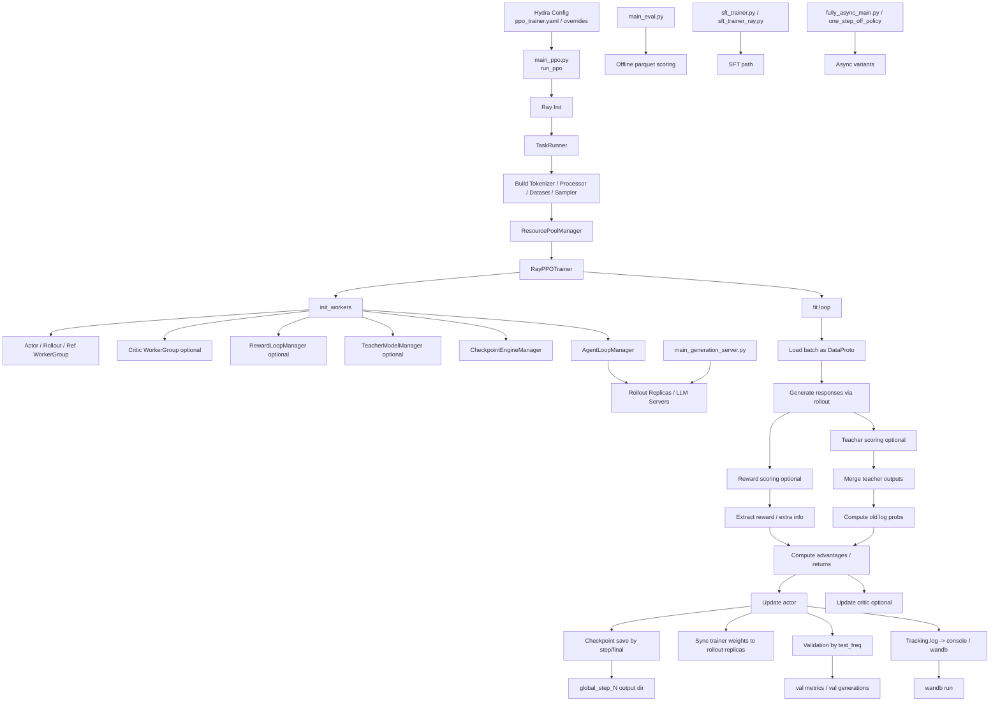

# verl Framework Full Flow

Updated: 2026-04-09 UTC

This document is a framework-level walkthrough of `verl`, based on:

- The official documentation homepage and linked pages under `https://verl.readthedocs.io/en/latest/`
- The vendored source tree in this workspace: `third_party/verl/verl`

It is not limited to the current OPSD recipe. The goal is to explain how `verl` is organized as a general framework, how the main runtime pieces fit together, and how training, generation, evaluation, and advanced async extensions are wired.

---

## 1. Executive Summary

`verl` is a large-model post-training framework built around one central idea:

- Keep the RL control flow in a single controller process.
- Keep heavy model computation in distributed worker processes.
- Connect them through a small set of uniform abstractions: `DataProto`, `Worker`, `WorkerGroup`, `ResourcePool`, `RayWorkerGroup`, trainer classes, and model engines.

The official docs describe this as `HybridFlow`: a decoupled control-flow / computation-flow design that tries to keep RL algorithm implementation flexible while still reusing high-performance training and inference backends.

In practice, `verl` is not only a PPO trainer. It is a framework that includes:

- RL training entrypoints
- SFT entrypoints
- evaluation and generation utilities
- backend-specific workers for FSDP / Megatron / model engine
- rollout infrastructure for vLLM / SGLang / TensorRT-LLM
- reward, agent, teacher, checkpoint, and async training loops

---

## 1.1 Framework Flow Diagram

This diagram is the shortest correct way to think about `verl`:

- config creates a controller
- controller creates resource pools and worker groups
- worker groups host the actual model computation
- the trainer loop orchestrates rollout, scoring, update, validation, checkpointing, and logging

---

## 2. Official Docs Map

This section groups the official docs visible from the homepage on 2026-04-09 UTC.

### 2.1 Quickstart

- Installation
- Quickstart: PPO training on GSM8K dataset
- Multinode Training
- Ray Debug Tutorial
- More Resources
- Agentic RL Training

### 2.2 Programming Guide

- HybridFlow Programming Guide
- The Design of `verl.single_controller`

### 2.3 Data Preparation

- Prepare Data for Post-Training
- Implement Reward Function for Dataset

### 2.4 Configurations

- Config Explanation

### 2.5 PPO Example

- PPO Example Architecture
- GSM8K Example
- Multi-Modal Example Architecture
- SkyPilot Examples

### 2.6 Algorithms

- Proximal Policy Optimization (PPO)
- Group Relative Policy Optimization (GRPO)
- Recipe: CollabLLM
- Recipe: Decoupled Clip and Dynamic Sampling Policy Optimization (DAPO)
- Recipe: Self-Play Fine-Tuning (SPIN)
- Recipe: Self-Play Preference Optimization (SPPO)
- Recipe: Entropy Mechanism
- On-Policy RL with Optimal Reward Baseline (OPO)
- Algorithm Baselines
- GPG: Group Policy Gradient
- Rollout Correction
- Mathematical Formulations of Rollout Correction Methods in verl
- Optimal Token Baseline (OTB)
- Divergence Proximal Policy Optimization (DPPO)

### 2.7 PPO Trainer and Workers

- PPO Ray Trainer
- PyTorch FSDP Backend
- Megatron-LM Backend
- Automodel Backend
- SGLang Backend
- TensorRT-LLM Backend
- Model Engine

### 2.8 Performance Tuning Guide

- Training DeepSeek 671b
- Verl LLM Best Practices (DAPO + Qwen3-235B)
- Performance Tuning Guide
- Performance Tuning Guide on Ascend
- Upgrading to vLLM >= 0.8
- Hardware Resource Needed for RL
- verl Profiler System
- NVIDIA Nsight Systems profiling in verl
- PyTorch Profiling in verl
- Precision Debugger (msprobe) in verl

### 2.9 Adding New Models

- Add models with the FSDP backend
- Add models with the Megatron-LM backend

### 2.10 Advanced Features

- Using Checkpoints to Support Fault Tolerance Training
- RoPE Scaling override
- Attention Implementation Override
- RL(HF) algorithms with LoRA Support
- Multi-turn Rollout Support
- Interaction System for Multi-turn RL Training
- Ray API Design Tutorial
- Extend to other RL(HF) algorithms
- Sandbox Fusion Example
- Trace Function Usage Instructions
- RolloutSkip Function Usage Documentation
- Recipe: One Step Off Policy Async Trainer
- Agent Loop
- Reward Loop
- Recipe: Fully Async Policy Trainer
- TransferQueue Data System
- Use Prometheus and Grafana to Monitor Rollout
- FP8 RL in verl
- NVFP4 QAT (Quantization-Aware Training) in verl
- Recipe: Async On-Policy Knowledge Distillation Trainer
- Guide to Using MTP in SFT/RL Training and Inference
- 1. Scope of Support
- 2. MTP Training Configuration (Core Parameters)
- 3. Experimental Results
- 4. Performance Notes for MTP in Rollout Inference
- 5. SFT training

### 2.11 Hardware Support

- Getting started with AMD (ROCM Kernel)
- verl performance tuning for AMD (ROCm Kernel)
- NPU-CI 添加指导
- Ascend Quickstart
- Ascend Dockerfile Build Guidance
- Ascend Quickstart with SGLang Backend
- 推理一致性指导
- Ascend Backend Features Guide
- Profiling采集指导
- Profiling Data Collection Guide
- NPU Qwen3-32B GSPO Optimization Practice
- Ascend Performance Analysis Guide
- DAPO multi model optimization practice
- Ascend SGLang Best Practice
- Ascend Retool Best Practice
- Long Sequence Qwen3-32B 1k-to-256k Example
- NPU 常见问题解答

### 2.12 API References

- Data interface
- Single Controller interface
- Trainer Interface
- Utilities

### 2.13 Other

- verl 0.7 release blog
- Frequently Asked Questions
- Editing Agent Instructions
- Sandbox Fusion Tool Integration

---

## 3. Recommended Reading Order

If the goal is to understand the framework from top to bottom, the most efficient order is:

1. `HybridFlow Programming Guide`
2. `The Design of verl.single_controller`
3. `Config Explanation`
4. `PPO Example Architecture`
5. `PPO Ray Trainer`
6. `PyTorch FSDP Backend` or `Megatron-LM Backend`
7. `Model Engine`
8. `Agent Loop`
9. `Reward Loop`
10. `Using Checkpoints to Support Fault Tolerance Training`
11. API docs for `Data interface`, `Single Controller interface`, `Trainer Interface`

That order matches the actual stack:

- design philosophy
- runtime abstraction
- configuration surface
- entrypoint and main loop
- backend implementation
- advanced runtime extensions

---

## 4. Core Design: HybridFlow

The official docs position `verl` as an implementation of the HybridFlow paper.

The key design decision is:

- RL is treated as a two-level dataflow problem.
- Control flow is algorithm orchestration.
- Computation flow is distributed model execution.

In `verl`, the control flow is intentionally kept separate from the computation flow:

- control flow: usually one controller / driver process
- computation flow: distributed model workers on GPUs

This leads to the framework’s main properties:

- algorithm logic can be changed without rewriting backend execution code
- backend engines can be swapped without rewriting the control loop
- placement of actor / rollout / critic / reward roles can be changed through resource mapping

This is the conceptual reason the framework is organized around `WorkerGroup` and `DataProto`, rather than around a monolithic single-process training loop.

---

## 5. Source Tree at a Glance

In the vendored source tree, the main framework areas are:

- `third_party/verl/verl/protocol.py`
- `third_party/verl/verl/single_controller`
- `third_party/verl/verl/trainer`
- `third_party/verl/verl/workers`
- `third_party/verl/verl/checkpoint_engine`
- `third_party/verl/verl/experimental`
- `third_party/verl/verl/models`
- `third_party/verl/verl/utils`

At a high level:

- `protocol.py`: data exchange format
- `single_controller`: distributed RPC abstraction layer
- `trainer`: training / evaluation / generation entrypoints
- `workers`: role-specific model workers and backends
- `checkpoint_engine`: fast weight sync and checkpoint coordination
- `experimental`: agent loop, reward loop, async trainers, teacher loop
- `models`: backend model definitions and integration glue
- `utils`: dataset, reward, tracking, fs, metric, profiler, backend helpers

---

## 6. Core Runtime Abstractions

### 6.1 `DataProto`

Code:

- `third_party/verl/verl/protocol.py`

`DataProto` is the standard data container used for inter-stage communication.

It contains:

- `batch`: tensor data in `TensorDict`
- `non_tensor_batch`: numpy / python side metadata
- `meta_info`: control metadata

Why it matters:

- the controller talks to workers using `DataProto`
- worker methods often take and return `DataProto`
- dispatch and collect logic in `WorkerGroup` is built around chunking / merging `DataProto`

This is the common wire format across rollout, reward, log-prob, value, update, checkpoint-related utilities, and some async flows.

### 6.2 `Worker`

Code:

- `third_party/verl/verl/single_controller/base/worker.py`

`Worker` is the base abstraction for a distributed role instance. A worker owns:

- distributed environment state
- rank / world size metadata
- device visibility and communication setup

Concrete role workers inherit from it, such as:

- actor / rollout / ref workers
- critic workers
- reward workers

### 6.3 `WorkerGroup`

Code:

- `third_party/verl/verl/single_controller/base/worker_group.py`
- `third_party/verl/verl/single_controller/ray/base.py`

`WorkerGroup` is the abstraction that makes a multi-process computation look like a single object from the controller’s perspective.

Instead of manually:

- splitting input
- dispatching RPCs to N workers
- collecting N outputs
- merging them

the controller calls a method once on a `WorkerGroup`, and the framework handles dispatch / execute / collect under the hood.

### 6.4 `RayWorkerGroup`

Code:

- `third_party/verl/verl/single_controller/ray/base.py`

`RayWorkerGroup` is the Ray-backed implementation of `WorkerGroup`.

It is responsible for:

- creating Ray actors on the desired placement groups
- binding worker methods to group methods
- managing group world size
- using dispatch modes to split and collect inputs and outputs

This is the main bridge between:

- single-process controller code
- multi-process GPU execution

### 6.5 `ResourcePoolManager`

Code:

- `third_party/verl/verl/single_controller/ray/base.py`

`ResourcePoolManager` defines where roles run.

It manages:

- resource pool specifications
- mapping from logical roles to pools
- pool creation and availability checks

This is where placement becomes a first-class framework concept. Different roles can share or split GPU resources depending on algorithm design and backend constraints.

### 6.6 `create_colocated_worker_cls`

Code:

- `third_party/verl/verl/single_controller/ray/base.py`

This utility fuses multiple logical roles into one Ray actor class, so that several roles can share a process and GPU allocation.

Typical use:

- colocate actor + rollout + ref

Why it matters:

- less duplicated CUDA / distributed runtime context
- potentially lower overhead
- better weight sharing / synchronization patterns

This is one of the concrete runtime mechanisms behind the “hybrid” part of HybridFlow.

---

## 7. Framework Entry Points

The framework has multiple executable entrypoints.

### 7.1 RL Training

Code:

- `third_party/verl/verl/trainer/main_ppo.py`

Purpose:

- main synchronous RL training entry for PPO-like flows

Behavior:

- initialize Ray
- create a remote task runner
- build datasets, tokenizer, workers, resource pools
- construct `RayPPOTrainer`
- call `fit()`

### 7.2 Evaluation

Code:

- `third_party/verl/verl/trainer/main_eval.py`

Purpose:

- offline scoring of generated parquet outputs

Behavior:

- load generated responses
- evaluate with reward function or custom reward function
- aggregate scores by `data_source`

### 7.3 Standalone Generation

Code:

- `third_party/verl/verl/trainer/main_generation_server.py`

Purpose:

- start standalone rollout servers
- generate responses over a prompt parquet
- save responses back to parquet

This is useful when generation is needed outside the main RL loop.

### 7.4 SFT

Code:

- `third_party/verl/verl/trainer/sft_trainer.py`
- `third_party/verl/verl/trainer/sft_trainer_ray.py`

Purpose:

- supervised fine-tuning

Important distinction:

- SFT is multi-controller when launched by `torchrun`
- RL in `main_ppo.py` is single-controller with Ray orchestration

### 7.5 Async / Experimental RL Entrypoints

Code:

- `third_party/verl/verl/experimental/fully_async_policy/fully_async_main.py`
- `third_party/verl/verl/experimental/one_step_off_policy/main_ppo.py`

Purpose:

- support more decoupled / streaming / async variants of policy training

These entrypoints reuse the same core abstractions, but change the orchestration pattern.

---

## 8. Generic RL Training Flow in verl

This is the framework-level flow for synchronous RL training, centered on `main_ppo.py` and `RayPPOTrainer`.

### Step 1. Load config

Hydra loads `ppo_trainer.yaml` and merges command-line overrides.

This config controls:

- data
- actor / rollout / ref
- critic
- reward
- algorithm
- trainer
- distributed resources

### Step 2. Initialize Ray runtime

`run_ppo()` initializes the Ray cluster and runtime environment.

### Step 3. Create remote controller task

A remote `TaskRunner` is created. This remote controller builds the training job from config.

### Step 4. Build datasets and sampler

The controller creates:

- training dataset
- validation dataset
- sampler
- collate function

For RL, the typical default is parquet-backed RLHF datasets.

### Step 5. Construct `RayPPOTrainer`

`RayPPOTrainer` is initialized with:

- config
- tokenizer
- processor if needed
- role-to-worker mapping
- resource pool manager
- worker group class
- train / val datasets

### Step 6. Initialize worker groups

`init_workers()` builds the distributed roles.

Common roles are:

- actor rollout ref
- critic
- reward model
- teacher model

Depending on config and backend, some roles may be:

- absent
- colocated
- isolated on separate resource pools

### Step 7. Initialize rollout infrastructure

The trainer creates an `AgentLoopManager`, which stands between the trainer and rollout servers / replicas.

This manager can support:

- regular single-turn generation
- multi-turn agentic interaction
- streamed reward / teacher integration in advanced modes

### Step 8. Initialize reward and teacher infrastructure

If configured:

- `RewardLoopManager` handles reward computation
- teacher loop infrastructure handles distillation teacher inference

These are optional framework-level subsystems, not hardcoded only for PPO.

### Step 9. Run `fit()`

The main loop starts.

At a high level, each training step looks like:

1. fetch a batch from the dataloader
2. wrap it as `DataProto`
3. send prompts to rollout
4. receive generated responses
5. compute old log-probs and optional ref log-probs
6. compute values if critic is enabled
7. compute reward signals
8. compute advantages / returns on the controller side
9. update actor
10. update critic if enabled
11. synchronize weights to rollout replicas
12. validate, log, save checkpoints when needed

This is the main generic RL dataflow that other algorithms in `verl` tend to inherit or modify.

---

## 9. PPO / GRPO Main Loop in More Detail

The trainer documentation and source both show the same pattern:

- rollout is a worker-group call
- reward is a worker-group or reward-function stage
- advantage computation stays lightweight on the controller
- actor / critic updates happen on distributed workers

The controller therefore behaves like the orchestration brain, not the compute engine.

This gives two important consequences:

### 9.1 Algorithm changes mostly live in control flow and loss logic

New RL algorithms generally change:

- advantage logic
- policy loss
- reward shaping
- rollout correction
- async scheduling

while still reusing:

- `DataProto`
- `WorkerGroup`
- rollout backends
- actor / critic workers

### 9.2 Backend changes mostly live under workers / engines

If the backend changes from:

- FSDP to Megatron
- vLLM to SGLang
- one model engine to another

the controller logic can often remain similar.

That separation is the main payoff of HybridFlow.

---

## 10. Backends and Execution Layers

### 10.1 FSDP Backend

Docs:

- `PyTorch FSDP Backend`

Source:

- `third_party/verl/verl/workers/fsdp_workers.py`
- `third_party/verl/verl/workers/actor/dp_actor.py`
- `third_party/verl/verl/workers/critic/dp_critic.py`

Use cases:

- algorithm research
- easier model bring-up
- HuggingFace-first workflows

Framework role:

- provides actor / rollout / ref / critic / reward worker implementations
- supports HybridEngine patterns with vLLM rollout

### 10.2 Megatron Backend

Docs:

- `Megatron-LM Backend`

Source:

- `third_party/verl/verl/workers/megatron_workers.py`
- `third_party/verl/verl/workers/actor/megatron_actor.py`
- `third_party/verl/verl/workers/critic/megatron_critic.py`

Use cases:

- maximum scalability
- large-model post-training
- 3D / 5D parallelism

Framework role:

- high-throughput large-scale backend
- supports `3DHybridEngine`

### 10.3 Model Engine Layer

Docs:

- `Model Engine`

Source:

- `third_party/verl/verl/workers/engine`

This layer abstracts:

- model init
- optimizer init
- lr scheduler init
- sharding
- checkpoint manager
- forward step

The official docs explicitly separate:

- base engine level
- full engine level
- worker / trainer level

This makes model-execution logic reusable across SFT and RL stacks.

### 10.4 Rollout Engines

Relevant source areas:

- `third_party/verl/verl/workers/rollout`
- `third_party/verl/verl/third_party/vllm`
- `third_party/verl/verl/utils/sglang`
- `third_party/verl/verl/utils/trtllm`

Framework role:

- generation is treated as a pluggable backend
- actor training and rollout inference can be colocated or separated

---

## 11. Single Controller vs Multi Controller

This is one of the most important conceptual distinctions in `verl`.

### Single Controller

Mainly used in RL:

- one controller process orchestrates the algorithm
- heavy computation lives in distributed worker groups
- Ray is used to provide RPC-style control over distributed workers

Representative entry:

- `main_ppo.py`

### Multi Controller

Mainly used in standard distributed training launched directly across ranks:

- each process participates in the trainer logic
- typical example is `torchrun` based SFT

Representative entry:

- `sft_trainer.py`

In other words:

- RL in `verl` is mostly controller-centric
- SFT in `verl` is mostly distributed-trainer-centric

This is why the framework docs separate `HybridFlow` / `single_controller` from model-engine trainers.

---

## 12. Agent Loop, Reward Loop, Teacher Loop

These are major runtime extensions that generalize `verl` beyond plain single-turn PPO.

### 12.1 Agent Loop

Docs:

- `Agent Loop`

Source:

- `third_party/verl/verl/experimental/agent_loop`

Role:

- general interface for multi-turn rollout and agentic RL
- wraps rollout servers and load balancers
- can run tool calls, environment interaction, reflections, or other user-defined loops

Why it matters:

- generation is no longer just “prompt in, text out”
- it becomes trajectory construction for multi-turn or tool-augmented training

### 12.2 Reward Loop

Docs:

- `Reward Loop`

Source:

- `third_party/verl/verl/experimental/reward_loop`

Role:

- distributed reward evaluation
- launch reward workers
- split batches across reward workers
- support rule-based, discriminative, generative, and hybrid reward setups

Why it matters:

- reward is treated as a pluggable distributed service
- it can be colocated or standalone
- it supports both simple verifier logic and model-based scoring

### 12.3 Teacher Loop

Source:

- `third_party/verl/verl/experimental/teacher_loop`

Role:

- async or colocated teacher inference for distillation-based training

Why it matters:

- `verl` is not only RLHF; it can also host knowledge-distillation and async teacher-student recipes

---

## 13. Checkpoint and Weight Synchronization Flow

Docs:

- `Using Checkpoints to Support Fault Tolerance Training`

Source:

- `third_party/verl/verl/checkpoint_engine/base.py`

There are two separate but related concerns:

### 13.1 Persistent checkpoints

Used for:

- resuming training
- fault tolerance
- saving model / optimizer / metadata

### 13.2 Runtime weight synchronization

Used for:

- pushing updated trainer weights to rollout replicas

The checkpoint engine manager coordinates trainer-side model engine and rollout replicas, and can:

- build process groups
- sleep rollout replicas
- wake rollout replicas
- push updated weights

This is a framework-level subsystem, not just a “save model” helper.

---

## 14. Logging, Metrics, and Validation

Relevant source:

- `third_party/verl/verl/utils/tracking.py`
- `third_party/verl/verl/trainer/ppo/metric_utils.py`
- `third_party/verl/verl/trainer/main_eval.py`

Framework responsibilities:

- runtime metric logging
- wandb / console / other backend tracking
- periodic validation
- offline evaluation from parquet outputs

This is why `verl` has both:

- online validation during RL training
- offline evaluation entrypoint after generation

---

## 15. How verl Extends to New Algorithms

Framework-wise, extending `verl` usually happens along one of three axes.

### 15.1 New control flow

Change:

- rollout scheduling
- reward timing
- advantage computation
- update order
- sync / async behavior

Typical place:

- trainer loop
- experimental async trainers

### 15.2 New losses / algorithm math

Change:

- PPO loss
- GRPO / DAPO / rollout correction
- distillation loss
- baselines / KL control / reward shaping

Typical place:

- `third_party/verl/verl/trainer/ppo`
- `third_party/verl/verl/trainer/distillation`

### 15.3 New backend or model integration

Change:

- worker implementation
- engine implementation
- rollout integration
- weight loaders

Typical place:

- `third_party/verl/verl/workers`
- `third_party/verl/verl/workers/engine`
- `third_party/verl/verl/models`

This is one of the strongest framework properties: algorithm extension and backend extension are intentionally separated.

---

## 16. A Practical Mental Model

If you need one compact mental model for `verl`, use this:

1. Config defines data, roles, resources, algorithm, and backend.
2. A single controller process builds the RL dataflow.
3. `WorkerGroup` objects expose distributed roles as if they were local method calls.
4. `DataProto` is the common packet passed between all major stages.
5. Rollout, reward, reference, critic, teacher, and actor update are separate distributed services.
6. Backend-specific complexity is pushed into workers and model engines.
7. Advanced loops like agent loop, reward loop, and async trainers extend the same core runtime model.

That is the real framework-level logic of `verl`.

---

## 17. Suggested Source Reading Order

If you want to read the code in the same order as the framework executes, use:

1. `third_party/verl/verl/trainer/README.md`
2. `third_party/verl/verl/trainer/main_ppo.py`
3. `third_party/verl/verl/trainer/ppo/ray_trainer.py`
4. `third_party/verl/verl/protocol.py`
5. `third_party/verl/verl/single_controller/base/worker.py`
6. `third_party/verl/verl/single_controller/base/worker_group.py`
7. `third_party/verl/verl/single_controller/ray/base.py`
8. `third_party/verl/verl/workers/fsdp_workers.py`
9. `third_party/verl/verl/workers/megatron_workers.py`
10. `third_party/verl/verl/workers/engine`
11. `third_party/verl/verl/experimental/agent_loop/agent_loop.py`
12. `third_party/verl/verl/experimental/reward_loop/reward_loop.py`
13. `third_party/verl/verl/checkpoint_engine/base.py`
14. `third_party/verl/verl/trainer/main_generation_server.py`
15. `third_party/verl/verl/trainer/main_eval.py`
16. `third_party/verl/verl/trainer/sft_trainer.py`

---

## 18. Official References

Docs homepage:

- https://verl.readthedocs.io/en/latest/

Core docs used in this summary:

- https://verl.readthedocs.io/en/latest/hybrid_flow.html
- https://verl.readthedocs.io/en/latest/single_controller.html
- https://verl.readthedocs.io/en/latest/examples/config.html
- https://verl.readthedocs.io/en/latest/examples/ppo_code_architecture.html
- https://verl.readthedocs.io/en/latest/workers/ray_trainer.html
- https://verl.readthedocs.io/en/latest/workers/fsdp_workers.html
- https://verl.readthedocs.io/en/latest/workers/megatron_workers.html
- https://verl.readthedocs.io/en/latest/workers/model_engine.html
- https://verl.readthedocs.io/en/latest/advance/agent_loop.html
- https://verl.readthedocs.io/en/latest/advance/reward_loop.html
- https://verl.readthedocs.io/en/latest/advance/checkpoint.html
- https://verl.readthedocs.io/en/latest/api/data.html
- https://verl.readthedocs.io/en/latest/api/single_controller.html
- https://verl.readthedocs.io/en/latest/api/trainer.html

Source tree used in this summary:

- `third_party/verl/verl`
